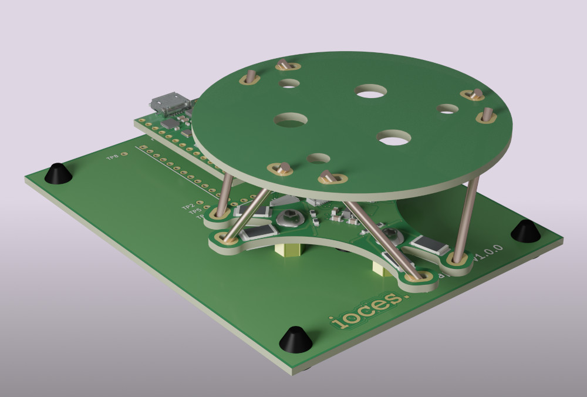

# Haptick - a 6DOF force sensitive input device

This design is a work in progress and is currently in the proof-of-concept prototyping phase. Progress is being documented via a series of [blog posts](https://blog.ioces.com/matt).

Ultimately the goal is to produce an open source alternative to the various [Spacemice](http://spacemice.org/index.php?title=Main_Page) on the market.

## License

This project is licensed under two separate licenses. The hardware design and documentation for this project is licensed under the [CERN Open Hardware Licence Version 2 - Strongly Reciprocal](https://ohwr.org/cern_ohl_s_v2.txt) (CERN-OHL-S-2.0). The software and firmware source code for the project is licensed under the [GNU General Public License Version 3](https://www.gnu.org/licenses/gpl-3.0.txt) (GPL-3.0-only).

Further details can be found in the [license file](LICENSE.md).